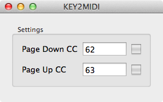

# KEY2MIDI

A simple Mac application to send keystroke information for Page Up and Page Down over Core MIDI

The purpose of this application is to enable pedal data from [AirTurn pedals](http://airturn.com) to be converted to [MIDI CC messages](http://en.wikipedia.org/wiki/MIDI#Messages) which can be received by any Mac application that supports them.

The latest version can be downloaded [here](https://github.com/jamiebullock/KEY2MIDI/releases)

## Usage

- Connect AirTurn pedals via bluetooth (ensure that the AirTurn is in “mode 1”)
- Launch KEY2MIDI
- Launch the application you want to send MIDI to and select “KEY2MIDI Source” as the source MIDI device
- Give KEY2MIDI focus
- Enter the CC numbers for Page Up and Page Down to be mapped to
- Press the AirTurn pedals

The indicators should light up if the pedals are working.

KEY2MIDI will send out a value of **127** when the pedal is down and **0** when it is released.

## Support

Raise an issue on [the tracker](https://github.com/jamiebullock/KEY2MIDI/issues)
